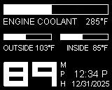

Overview
========

The goal of this project it to build a display for a car's instrument panel.

Display will include
- Engine coolant temp
- External temp
- Internal temp
- Speed (from GPS)
- Time (from GPS)
- Date (from GPS)

Parts List
==========

- 1x Arduino Pro Mini 328 - https://www.sparkfun.com/products/11113
- 1x Adafruit 1.8" LCD - http://www.adafruit.com/products/358
- 1x Adafruit Ultimate GPS - http://www.adafruit.com/products/746
- 3x ACDelco / GM Ambient Temperature Sensor (10K @ 25°C) - http://www.newgmparts.com/oe-gm/15936931

